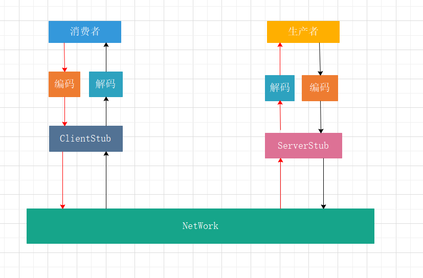

Netty实现Rpc

#### 1.什么是rpc

rpc是远程调用的简称，它是一种网络协议，简单的理解是一个节点请求另一个节点提供的服务。

rpc的调用过程示意图



rpc调用的过程为:

1.客户端将这个调用映射为一个call ID，将call ID以及参数进行编码(序列化成字节流)

2.ClientStub通过网络传输层(TCP)将数据发送

3.服务端接收到调用请求，先对数据进行解码(反序列化)，得到call ID和参数

4.服务端维护了一个Map<String, Method> callIdMap，通过call ID查找到相应的method

5.服务端调用method，并将执行结果进行编码

6.ServerStub将编码后的结果通过网络传输层发送

7.客户端收到结果，对结果进行解码，得到调用结果


#### 2.服务端

##### 2.1 NettyServerHandler 业务处理器

```Java

```

