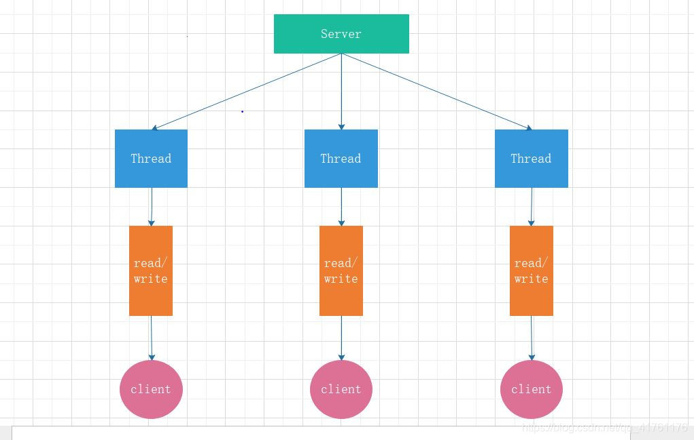
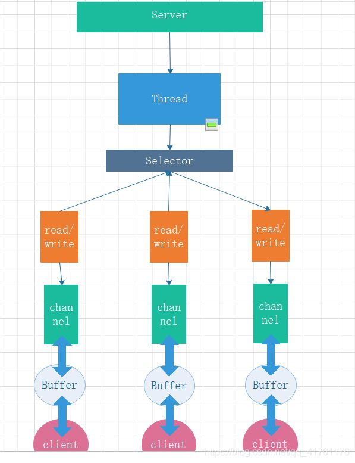
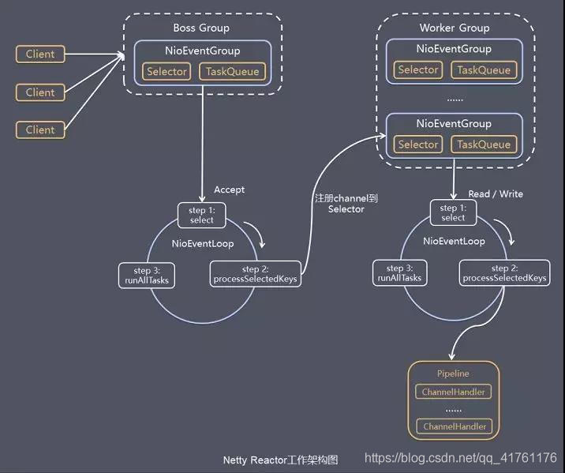

#### Netty架构与核心组件

Netty是一款基于Java原生Nio的能够提供异步的，事件驱动的高性能网络通讯框架。相对于原生的java Nio，Netty有以下优势:

1.使用jdk自带的nio需要了解太多的概念，编程复杂
2.netty底层IO模型随意切换，而这一切只需要做微小的改动
3.netty自带的拆包解包，异常检测等机制让你从nio的繁重细节中脱离出来，让你只需要关心业务逻辑
4.netty解决了jdk的很多包括空轮训在内的bug
5.netty底层对线程，selector做了很多细小的优化，精心设计的reactor线程做到非常高效的并发处理
6.自带各种协议栈让你处理任何一种通用协议都几乎不用亲自动手
7.netty社区活跃，遇到问题随时邮件列表或者issue
8.netty已经历各大rpc框架，消息中间件，分布式通信中间件线上的广泛验证，健壮性无比强大

首先看一下Nio，为什么Nio可以支持高并发场景呢？

​																		    	*Bio线程模型*

​																			     *Nio线程模型*

可以看出，Bio模型是一个线程支持一个客户端建立连接或者io读写，而建立连接和读写都基于Socket，这些操作都是阻塞的，等待Socket建立连接和io读写都需要服务端去做等待，期间线程不能处理其他事件，效率很低。

而Nio模型则是一个线程处理多个客户端请求，通过Selector组件以轮询的方式做线程调度，当轮询到监听的Socket有事件需要处理时，再交给线程去处理，这样io就没有阻塞，效率很高。

而且就Netty自身的代码实现来说，就很多值得去学习的地方，Reactor线程模型，设计模式，FastThreadLocal.......深入学习Netty源码是每个Java程序员都应该做的事情。

#### 1.Netty整体架构

这是Netty整体的架构图，从架构图可以看出，BossGroup封装了一个NioEventLoopGroup，BossGroup负责和Client对接，它负责处理客户端的accept事件。WorkerGroup里面封装了若干个NioEventLoopGroup，它负责处理read/write事件。最后，所有的io事件都会交给Pipeline组件去统一管理。

这个模型可以粗略的认为，BossGroup是老板，负责和客户对接，从客户那里拿到io事件，然后交给WorkerGroup工人去处理。而每个NioEventLoopGroup里面封装了NioEventLoop类，这个类是Netty reactor模型的核心组件。

#### 2.Netty核心组件

- NioEventLoop
- Pipeline
- Selector