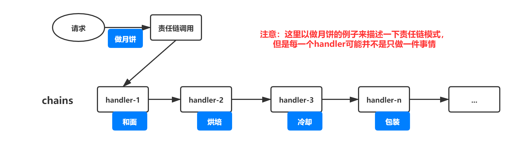
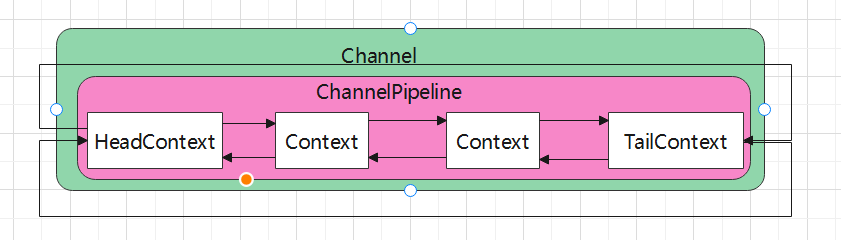
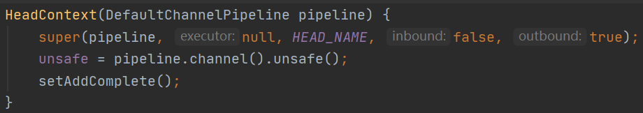
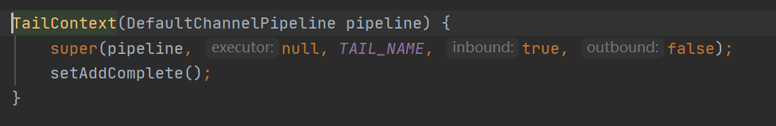
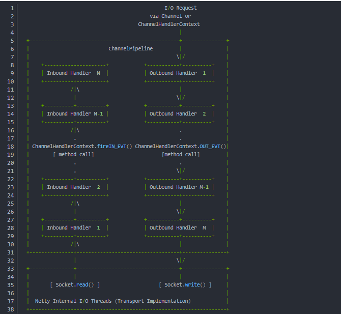
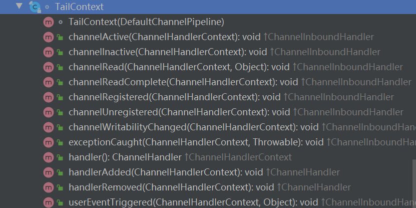
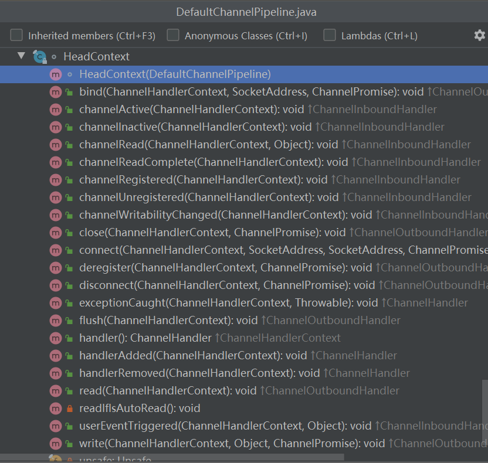
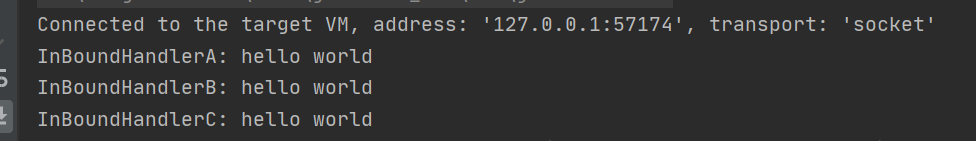

## Pipeline

[TOC]

先提出三个问题

:one:  Netty是如何判断ChannelHandler类型的？

:two:  对于ChannelHandler的添加要遵循怎么样的顺序?

:three:  用户手动触发事件传播，不同的触发方式有什么区别？


#### 1. 什么是Pipeline 

Pipeline被形容为Netty的大动脉，它就像人体的血管，Netty所有的事件传播都像血液一样在Pipeline里流动。Pipeline事件处理的设计思想，是经典的责任链模式的使用:

> 责任链模式:责任链模式为请求创建了一个处理对象的链,职责链上的处理者负责处理请求，客户只需要将请求发送到职责链上即可，无须关心请求的处理细节和请求的传递



解释完责任链模式，我们来看看Pipeline的数据结构:

首先，我们在Netty服务端启动流程中详细的介绍过服务端Channel的创建过程，我们回顾一下:

创建服务端Channel实际上是创建了一个AbstractChannel:

```Java
protected AbstractChannel(Channel parent) {
    this.parent = parent;
    id = newId();
    unsafe = newUnsafe();
    pipeline = newChannelPipeline();
}
```

可以看到，每个Channel都会对应一个pipeline，来看一看这个pipeline是如何创建的；

```Java
protected DefaultChannelPipeline(Channel channel) {
    this.channel = ObjectUtil.checkNotNull(channel, "channel");
    succeededFuture = new SucceededChannelFuture(channel, null);
    voidPromise =  new VoidChannelPromise(channel, true);
    tail = new TailContext(this);
    head = new HeadContext(this);
    head.next = tail;
    tail.prev = head;
}
```

可以看出，每个Pipeline都有一个channel属性并和这个Pipeline对应的channel做绑定。

然后创建了tail,head两个Context，TailContext和HeadContext都继承于AbstractChannelHandlerContext。

然后对头节点和尾节点做了一个连接，形成了一个双向链表的数据结构，所以Pipeline的结构是这样的:



head和tail之间可以添加多个HandlerContext用于事件处理，如添加一个StringEncodeHandler可以进行字符串编码。每个HandlerContext都各自处理自己的事件，处理完成以后通过链表的指针获取下一个HandlerContext通知下一个节点处理，各个节点之间的业务没有干扰，业务充分解耦。

#### 2. Pipeline初始化

上文中已经介绍了ChannelPipeline的创建，主要创建了head和tail两个Context并形成了双向链表的数据结构，下面深入看看这两个Context:





从传入的inbound和outbound参数可以看出，HeadContext处理的是Outbound事件，TailContext处理的是Inbount事件，关于Inbound和Outbound他们的区别在于：Inbound处理读事件，Outbound处理写事件，Netty官方有个示意图:



下面来重点分析一下Pipeline的这两大哨兵HeadContext和TailContext：

首先是TailContext,它有以下方法



其实大部分方法都没有做业务逻辑处理，主要处理写在exceptionCaught和channelRead方法中

```Java
@Override
public void exceptionCaught(ChannelHandlerContext ctx, Throwable cause) throws Exception {
    onUnhandledInboundException(cause);
}

@Override
public void channelRead(ChannelHandlerContext ctx, Object msg) throws Exception {
    onUnhandledInboundMessage(msg);
}
```

这两个方法也很简单，exceptionCaught方法主要对没有进行异常捕获的报错信息做一个日志打印，channelRead方法是对没有进行处理的事件进行日志打印。可以看出TailContext主要做了一些Pipeline收尾的事情。

HeadContext:



可以看出，HeadContext真正执行了许多业务处理，如bind,channelActive,register2,connect.....，都是通过unsafe实现调用底层接口进行了数据的读写。同时HeadContext中channelActive，channelRead等事件会向下传播

```Java
@Override
public void channelRead(ChannelHandlerContext ctx, Object msg) throws Exception {
    ctx.fireChannelRead(msg);
}
```

有关Pipeline的事件和异常传播，后面会详细介绍。

#### 3. 添加用户自定义ChannelHandler

:pineapple:   添加ChannelHandler

之前我们介绍服务端启动的时候有一段添加ChannelHandler的地方:

```Java
.childHandler(new ChannelInitializer<SocketChannel>() {
    @Override
    public void initChannel(SocketChannel ch) {
        ch.pipeline().addLast(new AuthHandler());
    }
});
```

这个addLast方法就是添加ChannelHandler的入口:

真正的业务处理在DefaultChannelPipeline的addLast方法:

```Java
@Override
public final ChannelPipeline addLast(EventExecutorGroup group, String name, ChannelHandler handler) {
    final AbstractChannelHandlerContext newCtx;
    synchronized (this) {
        checkMultiplicity(handler);
        newCtx = newContext(group, filterName(name, handler), handler);
        //将节点加入到双向链表
        addLast0(newCtx);
        EventExecutor executor = newCtx.executor();
        if (!executor.inEventLoop()) {
            newCtx.setAddPending();
            executor.execute(new Runnable() {
                @Override
                public void run() {
                    callHandlerAdded0(newCtx);
                }
            });
            return this;
        }
    }
    //用户回调
    callHandlerAdded0(newCtx);
    return this;
}
```

这里面主要做了几件事情:

1.检查Handler是否被重复添加，在checkMultiplicity中实现

2.将Handler封装成一个ChannelHandlerContext

```Java
newCtx = newContext(group, filterName(name, handler), handler);
```

3.通过addLast0方法将ChannelHandlerContext节点加到Pipeline双向链表结构

```Java
private void addLast0(AbstractChannelHandlerContext newCtx) {
    AbstractChannelHandlerContext prev = tail.prev;
    newCtx.prev = prev;
    newCtx.next = tail;
    prev.next = newCtx;
    tail.prev = newCtx;
}
```

4.用户Handler回调

用户Handler回调发生在callHandlerAdded0()方法,callHandlerAdded0()方法主要逻辑在下面这两行:

```java
ctx.handler().handlerAdded(ctx);
ctx.setAddComplete();
```

handlerAdded会调用用户Handler里面实现的handlerAdded方法，这就是用户Handler回调。

setAddComplete：

```Java
final void setAddComplete() {
    for (;;) {
        int oldState = handlerState;
        if (oldState == REMOVE_COMPLETE || HANDLER_STATE_UPDATER.compareAndSet(this, oldState, ADD_COMPLETE)) {
            return;
        }
    }
}
```

这个方法用了一个死循环，直到Handler为被remove状态或者以CAS的方式设置为ADD_COMPLETE状态退出循环。此时Handler为被添加，所以Handler的状态设置为了ADD_COMPLETE

#### 4. inBound和outBound事件的传播

上面的分析中提到过，inBound事件是读事件，outBound事件是写事件。那么所有的事件，是如何在Pipeline中传播起来，这个责任链是怎么流通的呢？下面分别以channelRead事件和...事件为例，分析inBound和outBound事件在pipeline中的传播。

 :pineapple: **inBound事件的传播**

首先以一段简单的代码，演示inBound事件的传播:

```Java
public static void main(String[] args) throws Exception {
    EventLoopGroup bossGroup = new NioEventLoopGroup(1);
    EventLoopGroup workerGroup = new NioEventLoopGroup();
    try {
        ServerBootstrap b = new ServerBootstrap();
        b.group(bossGroup, workerGroup)
                .channel(NioServerSocketChannel.class)
                .childOption(ChannelOption.TCP_NODELAY, true)
                .childAttr(AttributeKey.newInstance("childAttr"), "childAttrValue")
                .childHandler(new ChannelInitializer<SocketChannel>() {
                    @Override
                    public void initChannel(SocketChannel ch) {
                        ch.pipeline().addLast(new InBoundHandlerA());
                        ch.pipeline().addLast(new InBoundHandlerB());
                        ch.pipeline().addLast(new InBoundHandlerC());
                    }
                });
        ChannelFuture f = b.bind(8888).sync();
        f.channel().closeFuture().sync();
    } finally {
        bossGroup.shutdownGracefully();
        workerGroup.shutdownGracefully();
    }
}
```

这是一段服务端启动的代码，服务端Channel顺序添加了A,B,C三个自定义InBoundHandler，每个Handler做相同的操作:

```Java
public void channelRead(ChannelHandlerContext ctx, Object msg) throws Exception {
    System.out.println("InBoundHandlerA: " + msg);
    ctx.fireChannelRead(msg);
}
```

下面就以ChannelRead事件为例分析inBound事件的传播过程

首先手动触发ChannelRead()事件:

```Java
public void channelActive(ChannelHandlerContext ctx) {
    ctx.channel().pipeline().fireChannelRead("hello world");
}
```

fireChannelRead方法

```Java
public final ChannelPipeline fireChannelRead(Object msg) {
    AbstractChannelHandlerContext.invokeChannelRead(head, msg);
    return this;
}
```

fireChannelRead方法就是ChannelRead事件传播的方法。可以看出，inBound事件是从head节点开始传播的

继续往下，看看invokeChannelRead方法：

```Java
static void invokeChannelRead(final AbstractChannelHandlerContext next, Object msg) {
    final Object m = next.pipeline.touch(ObjectUtil.checkNotNull(msg, "msg"), next);
    next.invokeChannelRead(m);
	//......
}
```

再往下，调用了重载的invokeChannelRead方法，这时候next就是HeadContext

```Java
private void invokeChannelRead(Object msg) {
    if (invokeHandler()) {
      ((ChannelInboundHandler) handler()).channelRead(this, msg);
    } else {
        fireChannelRead(msg);
    }
}
```

这里会先调用invokeHandler判断Handler的状态

```Java
private boolean invokeHandler() {
    int handlerState = this.handlerState;
    return handlerState == ADD_COMPLETE || (!ordered && handlerState == ADD_PENDING);
}
```

而我们之前提到Handler添加调用addLast方法的时候提到过，addLast方法最后会进行用户Handler回调，回调完成会设置Handler状态，也就是会设置this.handlerState为ADD_COMPLETE，因此这个方法会返回true

所以invokeChannelRead会执行下面这一段：

```Java
((ChannelInboundHandler) handler()).channelRead(this, msg);
```

channelRead方法会调用到HeadContext的channelRead方法：

```Java
public void channelRead(ChannelHandlerContext ctx, Object msg) throws Exception {
    ctx.fireChannelRead(msg);
}
```

HeadContext的channelRead方法没有做什么处理，只是将事件向下传播

```Java
public ChannelHandlerContext fireChannelRead(final Object msg) {
    invokeChannelRead(findContextInbound(), msg);
    return this;
}
```

这里就是真正inBound事件向下传播的地方了。这个invokeChannelRead是不是很熟悉?走了一圈又回到了invokeChannelRead，那变化在哪里呢？变化在调用的对象不一样了。

此时的对象为findContextInbound()方法返回的对象，findContextInbound()方法:

```Java
private AbstractChannelHandlerContext findContextInbound() {
    AbstractChannelHandlerContext ctx = this;
    do {
        ctx = ctx.next;
    } while (!ctx.inbound);
    return ctx;
}
```

这个方法作用就像它的方法名描述的那样，在Pipeline的双向链表结构中寻找下一个inBound节点，如果找到了就结束while循环，并返回这个对象，所以这里返回的是head.next,那么在双向链表结构中，head.next是谁呢？

按照我们添加的顺序，就是InBoundHandlerA。所以后面就按照之前的流程，对象由HeadContext换为InBoundHandlerA重新来一次，最终会调用到InBoundHandlerA的channelRead方法:

```Java
public void channelRead(ChannelHandlerContext ctx, Object msg) throws Exception {
    System.out.println("InBoundHandlerA: " + msg);
    ctx.fireChannelRead(msg);
}
```

在进行自己的业务处理后，又调用了fireChannelRead方法，然后又重新找下一个inBoundHander节点，一直往下进行,直到找到最后一个inBoundHandlerTailContext​ ​ ==> TailContext,传播到TailContext的channelRead方法：

```jAVA
public void channelRead(ChannelHandlerContext ctx, Object msg) throws Exception {
    onUnhandledInboundMessage(msg);
}
```

TailContext的channelRead方法并没有将事件继续向下传播，而是做了一些收尾的事情:异常信息日志打印，资源释放等。所以inBound事件传播到这里，就结束了。

到这里可以对inBound事件的传播做一个总结:

:one:  用户手动触发ChannalRead事件，事件从HeadContext开始执行

:two:  HeadContext调用invokeChannelRead，执行自身实现的channelRead()方法

:three:  HeadContext通过fireChannelRead方法，在双向链表中找到下一个inBound节点，向下传播

:four:  节点依次向下传播，直到传播到TailContext，不再向下传播,传播结束


通过telnet连接服务端，输出的结果为:



打印顺序为A,B,C，与预期的结果符合。

:pineapple:  outBound事件的传播

上面以channelRead事件为例分析了inBound事件的传播，下面以类似的流程，以write事件为例，分析outBound事件的传播过程:

首先同样上一段服务端代码

```Java
public static void main(String[] args) throws Exception {
    EventLoopGroup bossGroup = new NioEventLoopGroup(1);
    EventLoopGroup workerGroup = new NioEventLoopGroup();
    try {
        ServerBootstrap b = new ServerBootstrap();
        b.group(bossGroup, workerGroup)
                .channel(NioServerSocketChannel.class)
                .childOption(ChannelOption.TCP_NODELAY, true)
                .childAttr(AttributeKey.newInstance("childAttr"), "childAttrValue")
                .childHandler(new ChannelInitializer<SocketChannel>() {
                    @Override
                    public void initChannel(SocketChannel ch) {
                        ch.pipeline().addLast(new OutBoundHandlerA());
                        ch.pipeline().addLast(new OutBoundHandlerB());
                        ch.pipeline().addLast(new OutBoundHandlerC());
                    }
                });

        ChannelFuture f = b.bind(8888).sync();
        f.channel().closeFuture().sync();
    } finally {
        bossGroup.shutdownGracefully();
        workerGroup.shutdownGracefully();
    }
}
```

Pipeline添加了三个outBoundHandler，以A,B,C的顺序添加

每个handler都做了下面这件事情

```Java
public void write(ChannelHandlerContext ctx, Object msg, ChannelPromise promise) {
    System.out.println("OutBoundHandlerA: " + msg);
    ctx.write(msg, promise);
}
```

打印信息并且传播。

OutBoundHandlerB加了一段用户回调:

```Java
public void handlerAdded(final ChannelHandlerContext ctx) {
    ctx.executor().schedule(() -> {
        ctx.channel().write("hello world");
    }, 3, TimeUnit.SECONDS);
}
```

当B被添加成功时这段代码会触发执行。

所以从ctx.channel().write("hello world")开始分析:

write方法会进入到DefaultChannelPipeline类的write方法

```Java
public final ChannelFuture write(Object msg) {
    return tail.write(msg);
}
```

可以看出，outBound事件是从TailContext开始传播的，TailContext类的write方法:

```
public ChannelFuture write(final Object msg, final ChannelPromise promise) {
    //...
    write(msg, false, promise);
    return promise;
}
```

这个promise是用户的回调，这里为空。

继续往下:

```Java
private void write(Object msg, boolean flush, ChannelPromise promise) {
    AbstractChannelHandlerContext next = findContextOutbound();
    final Object m = pipeline.touch(msg, next);
    EventExecutor executor = next.executor();
    if (executor.inEventLoop()) {
        if (flush) {
            next.invokeWriteAndFlush(m, promise);
        } else {
            next.invokeWrite(m, promise);
        }
    } else {
        //...
    }
}
```

这里我们看到了和inBound事件传播类似的方法:findContextOutbound(),从字面意思可以看出是寻找下一个outBound节点：

```Java
private AbstractChannelHandlerContext findContextOutbound() {
    AbstractChannelHandlerContext ctx = this;
    do {
        ctx = ctx.prev;
    } while (!ctx.outbound);
    return ctx;
}
```

与inBound事件不同的是，outBound事件是每次都在双向链表中寻找前一个节点，tail的前一个节点是C，因此这里的next是OutBoundHandlerC.

得到下一个节点以后，开始向前传播:

```java
private void invokeWriteAndFlush(Object msg, ChannelPromise promise) {
    if (invokeHandler()) {
        invokeWrite0(msg, promise);
        invokeFlush0();
    } else {
        writeAndFlush(msg, promise);
    }
}
```

invokeWrite0:

```Java
private void invokeWrite0(Object msg, ChannelPromise promise) {
    try {
        ((ChannelOutboundHandler) handler()).write(this, msg, promise);
    } catch (Throwable t) {
        notifyOutboundHandlerException(t, promise);
    }
}
```

这里的write是调用了OutBoundHandlerC的write方法:

```Java
public void write(ChannelHandlerContext ctx, Object msg, ChannelPromise promise){
    System.out.println("OutBoundHandlerC: " + msg);
    ctx.write(msg, promise);
}
```

打印信息以后，会继续向前传播,然后一直向前传播，传播到最后一个OutBoundHandler ==》HeadContext

所以最后会执行HeadContext的write方法:

```Java
public void write(ChannelHandlerContext ctx, Object msg, ChannelPromise promise) {
    unsafe.write(msg, promise);
}
```

看到这里就很明显了，HeadContext会通过Pipeline对应的channel的unsafe调用Nio底层的write方法进行write。


同样，这里对outBound事件的传播做一个总结:

:one:  HandlerAdd触发回调，手动触发write

:two:  write事件从tail节点开始传播，通过findOutBoundHandler方法寻找前一个OutBoundHandler

:three:  按照这个过程一直前传播，直到传播到HeadContext

:four:  HeadContext拿到Channel的unsafe，进行写数据操作


到这里Pipeline就全部分析完了，回到最开始提出的三个问题，依次解答

:one:  Netty是如何判断ChannelHandler类型的？

Netty会根据Handler的inboud和outboud属性的值判断ChannelHandler类型是inBound还是outBound

:two:  对于ChannelHandler的添加要遵循怎么样的顺序?

InBoundHandler执行顺序与添加顺序相同，OutBoundHandler相反。

:three:  用户手动触发事件传播，不同的触发方式有什么区别？

用户手动触(ctx.pipeline().fireChannelRead)发则从HeadContext或者TailContext节点开始传播，

自动触发(ctx.fireChannelRead)则从当前节点开始传播。