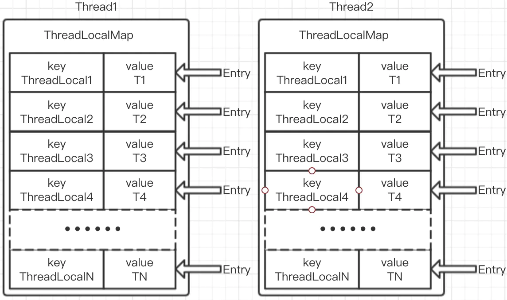

### ThreadLocal

- **什么是ThreadLocal**

  jdk在1.2版本就引入了ThreadLocal类，ThreadLocal叫线程变量，意思是ThreadLocal中填充的变量属于当前线程，该变量对其他线程而言是隔离的。ThreadLocal为变量在每个线程中都创建了一个副本，那么每个线程可以访问自己内部的副本变量。

  也就是说，ThreadLocal维护了一种数据结构用户保存变量，这些变量对于每个线程而言都是独立的，每个线程都只能对自己的变量进行读写。ThreadLocal用这种牺牲空间的方式，一定程度保证了线程安全性。

  ThreadLocal用途很广泛，可用于进行事务操作、数据库连接session管理，线程数据隔离等。当然最主要的用途是线程间数据隔离。

- ThreadLocal数据结构

  ThreadLocal本质就是维护了一种数据结构用户保存线程变量，具体的数据结构如图:

  

  ThreadLocal的数据结构涉及以下概念:Thread,ThreadLocalMap,Entry

  这三者的关系为:每一个Thread线程都维护了ThreadLocalMap，每个ThreadLocalMap中维护了一个数组Entry[]，Entry数组中保存了若干个key-value，key是ThreadLocal对象经过hash运算后的值，value为具体保存的变量值。

  从数据结构可以看出，每个线程都维护了一个ThreadLocalMap，而ThreadLocal负责完成对ThreadLocalMap的get set操作。


​		下面从源码角度分析:

​		set方法:

```java
public void set(T value) {
    Thread t = Thread.currentThread();
    ThreadLocalMap map = getMap(t);
    if (map != null)
        map.set(this, value);
    else
        createMap(t, value);
}
```

该方法很简单，先获取当前调用set方法的线程，然后通过getMap(Thread t)方法获取到当前线程对应的ThreadLocalMap,getMap方法具体实现为:

```java
ThreadLocal.ThreadLocalMap threadLocals = null;

ThreadLocalMap getMap(Thread t) {
    return t.threadLocals;
}
```

如果getMap返回的ThreadLocalMap不为空，则直接调用ThreadLocalMap的set方法，以当前ThreadLocal对象为key，变量为value保存到ThreadLocalMap中，如果为空，则调用createMap方法创建一个属于当前线程的ThreadLocalMap，并将value保存进去。

下面来看看ThreadLocalMap的set方法:

```
private void set(ThreadLocal<?> key, Object value) {
    Entry[] tab = table;
    int len = tab.length;
    int i = key.threadLocalHashCode & (len-1);

    for (Entry e = tab[i];e != null;e = tab[i = nextIndex(i, len)]) {
        ThreadLocal<?> k = e.get();

        if (k == key) {
            e.value = value;
            return;
        }

        if (k == null) {
            replaceStaleEntry(key, value, i);
            return;
        }
    }

    tab[i] = new Entry(key, value);
    int sz = ++size;
    if (!cleanSomeSlots(i, sz) && sz >= threshold)
        rehash();
}
```

这段代码也容易看懂。先通过hash计算得到一个Entry[]的下标i，然后通过一段for循环看看是否有hash冲突，如果冲突的key相同，则直接替换value。如果key为空则直接加入。for循环以后如果还能继续执行说明当前Entry[]已满，然后进行扩容操作，将value放进去。

这是典型的线性探测法解决hash冲突的用法。

下面看看get方法:

```
public T get() {
    Thread t = Thread.currentThread();
    ThreadLocalMap map = getMap(t);
    if (map != null) {
        ThreadLocalMap.Entry e = map.getEntry(this);
        if (e != null) {
            @SuppressWarnings("unchecked")
            T result = (T)e.value;
            return result;
        }
    }
    return setInitialValue();
}
```

get方法也比较简单，也是通过ThreadLocalMap来获取当前调用get方法的ThreadLocal对象的Entry，

如果获取不到进行setInitialValue()操作，即将当前ThreadLocal设置到ThreadLocalMap，并且value为null，然后返回null。如果ThreadLocalMap为null，则进行createMap操作。

- **ThreadLocal值得关注的问题**

  1、ThreadLocalMap的扩容大小为0x61c88647，这是斐波那契散列乘数,它的优点是通过它散列(hash)出来的结果分布会比较均匀，可以很大程度上避免hash冲突。

  2、ThreadLocalMap中的Entry继承了WeakReference，因此当ThreadLocal == null时，GC会对ThreadLocal对象进行回收，但是Thread不停止，ThreadLocalMap会一直存在，这样一来就造成了ThreadLocalMap中存在一条没有意义的数据：key为null，value有值，这样一来就造成了内存泄漏，因此ThreadLocal使用完成以后，请调用remove方法。

  3、ThreadLocal相当于全局变量，会提高代码的耦合性，因此使用需要慎重。

- FastThreadLocal